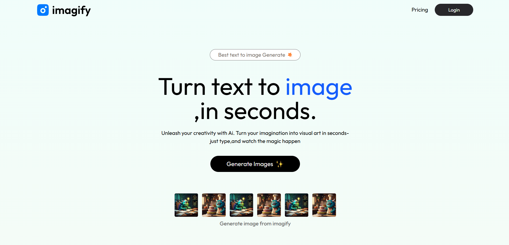
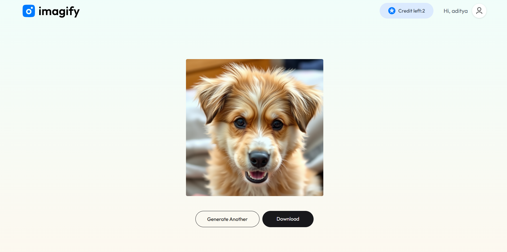

# IMAGIFY – Full Stack Text to Image Generator AI SaaS App (MERN)





## Overview

**IMAGIFY** is a full-stack AI SaaS application built using the **MERN stack** – MongoDB, Express.js, React.js, and Node.js. It allows users to **generate images from text prompts** using an integrated AI API. The app includes a fully functional **authentication system**, a **credit-based generation model**, and **payment gateway integration** to purchase more credits.

---

## Features

- 🔐 Full user authentication (Sign Up / Login)
- 🎨 Generate AI images using **ClipDrop API**
- 💳 Credit system for image generation
- 🛒 Integrated payment gateway to buy more credits
- 📦 Backend built with Express and MongoDB
- 🌐 Frontend built with React.js
- 📁 Organized folder structure for scalability
- ✨ Beautiful and responsive UI

---

## Folder Structure

```bash
IMAGIFY/
├── backend/
│   ├── controllers/
│   ├── models/
│   ├── Routes/
│   ├── utils/
│   ├── app.js
│   ├── server.js
│   └── .env
│
├── client/
│   ├── public/
│   │   └── favicon.svg
│   ├── src/
│   │   ├── assets/
│   │   ├── components/
│   │   ├── context/
│   │   ├── pages/
│   │   ├── App.jsx
│   │   ├── main.jsx
│   │   ├── App.css
│   │   └── index.css
│   └── .env
│
├── README.md
```

---

## Technologies Used

- MongoDB
- Express.js
- React.js
- Node.js
- ClipDrop API
- Stripe / Razorpay (for payment)
- Context API
- JWT Authentication

---

## How It Works

1. **User Registration/Login:** Secure auth system using JWT.
2. **Credits System:** Users start with free credits.
3. **Image Generation:** Enter a text prompt to generate an AI image using ClipDrop.
4. **Buy Credits:** Users can purchase more credits via payment integration.
5. **View Generated Images:** History of generated images stored in the user’s account.

---

## Screenshots

> Place 3 screenshots in a `/screenshots/` folder as `1.png`, `2.png`, `3.png`

---

## Getting Started

```bash
# Clone the repo
git clone https://github.com/your-username/imagify.git
cd imagify

# Setup Backend
cd backend
npm install
npm start

# Setup Frontend
cd ../client
npm install
npm run dev
```

---


